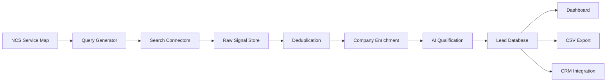

# System Architecture

## Overview

The NCS AI Lead Generation Engine has five major layers:

1. Service intelligence
2. Search and discovery
3. Enrichment and validation
4. AI qualification
5. Sales workflow

## Recommended Stack

### Frontend

- Next.js
- React
- Tailwind CSS or a component system such as shadcn/ui

### Backend

- Python FastAPI or Node.js/NestJS
- REST API for MVP
- Background workers for search jobs

### Database

- PostgreSQL
- pgvector for future semantic matching

### Queue

- Celery with Redis for Python
- BullMQ with Redis for Node.js

### Search Providers

Use one or more providers:

- Bing Web Search API
- Google Custom Search API
- SerpAPI
- Tavily
- Exa
- Perplexity-style research API, if approved

### Enrichment Providers

Use only compliant providers and public APIs:

- Companies House API
- Clearbit-style company enrichment
- Apollo, People Data Labs, or similar B2B providers with GDPR controls
- BuiltWith or Wappalyzer-style technology detection
- Public company websites

### AI Layer

Use an LLM for:

- Query expansion
- Intent classification
- Company summary
- Service matching
- Lead scoring explanation
- Outreach draft generation

## Key Components

### Service Map Builder

Creates a structured list of NCS services, keywords, synonyms, industries, and problem statements.

Example:

- Service: Cloud Migration
- Keywords: Azure migration, cloud modernisation, legacy migration, migrate to Azure
- Problems: cost reduction, legacy infrastructure, scalability, security
- Buyer roles: CTO, Head of Infrastructure, IT Director

### Query Generator

Generates search queries using templates.

Examples:

- `"Oracle database migration" "UK" "looking for"`
- `"Power BI consultant" "London" "needed"`
- `"Azure migration partner" "UK"`
- `"database disaster recovery" "tender"`
- `"SQL Server DBA" "urgent" "company"`
- `"data maturity assessment" "UK business"`

### Search Orchestrator

Runs search jobs by service, source type, and region.

Responsibilities:

- Schedule searches
- Rotate query templates
- Fetch search results
- Store raw results
- Avoid repeated processing
- Track source freshness

### Signal Extractor

Reads pages and extracts:

- Company name
- Intent phrase
- Source type
- Service category
- Location
- Dates
- Contact links
- Evidence snippet

### Lead Scorer

Scores leads from 0 to 100.

Recommended scoring factors:

- Service fit: 30 points
- Intent strength: 25 points
- Recency: 15 points
- UK relevance: 10 points
- Company fit: 10 points
- Contactability: 10 points

### Dashboard

MVP views:

- Lead list
- Lead detail
- Source evidence
- Service filters
- Score filters
- Export view
- Suppression list

### CRM Integration

Phase 2 integrations:

- HubSpot
- Salesforce
- Zoho
- Pipedrive

CRM sync should include:

- Company
- Deal/service interest
- Source URL
- Lead score
- Outreach draft
- Assigned owner
- Status

## Data Flow

1. Admin selects service area and region.
2. Query generator creates search queries.
3. Search connector fetches public results.
4. Raw results are stored with source metadata.
5. Signal extractor parses pages and snippets.
6. Deduplication merges repeated companies.
7. Enrichment fills company profile fields.
8. AI scorer classifies service fit and urgency.
9. Qualified leads appear in dashboard.
10. Sales user reviews, edits, exports, or pushes to CRM.

## Security

- API keys stored in environment variables.
- No secrets in the frontend.
- Role-based access for dashboard users.
- Audit log for exports and lead status changes.
- Encryption at rest for contact data.
- Suppression list checked before export or CRM sync.

